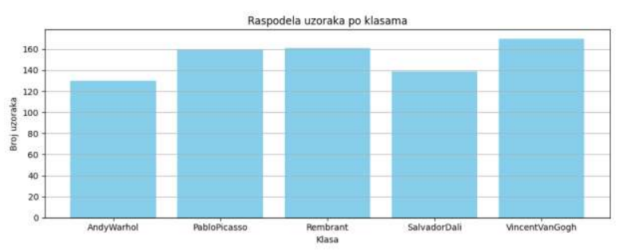
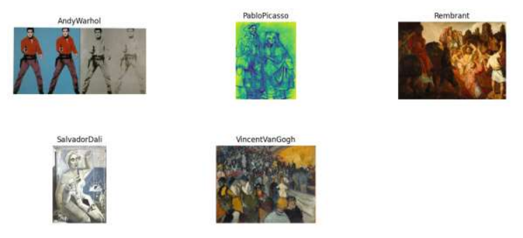
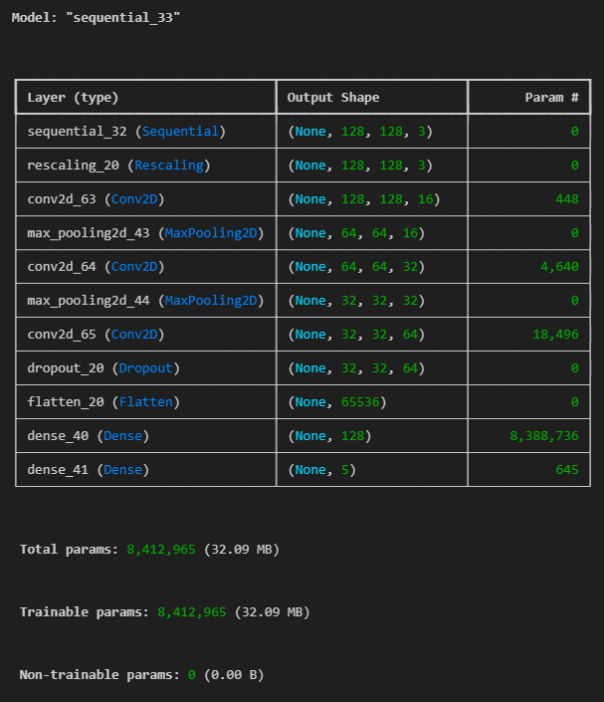
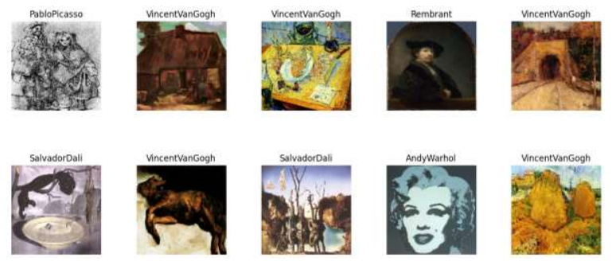
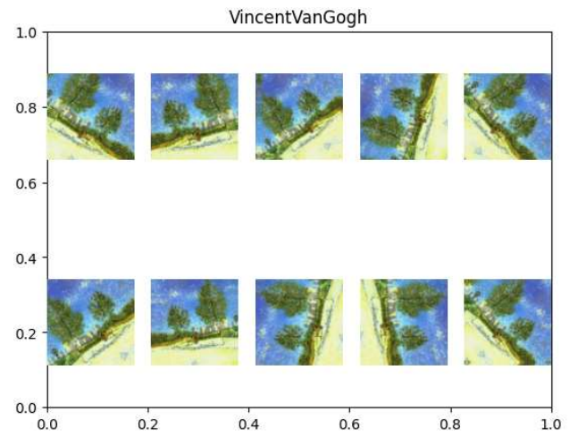
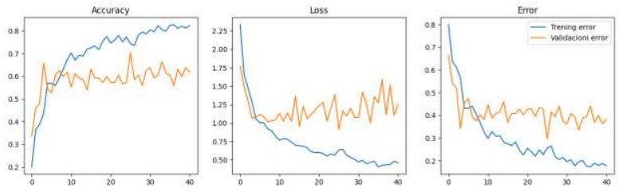
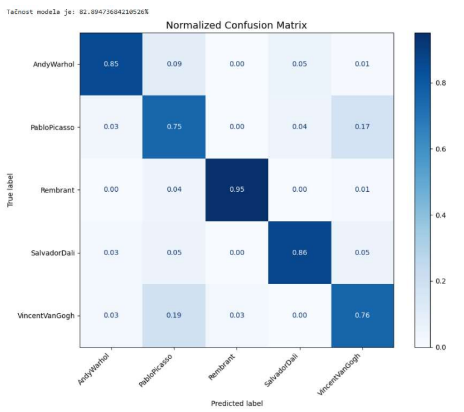
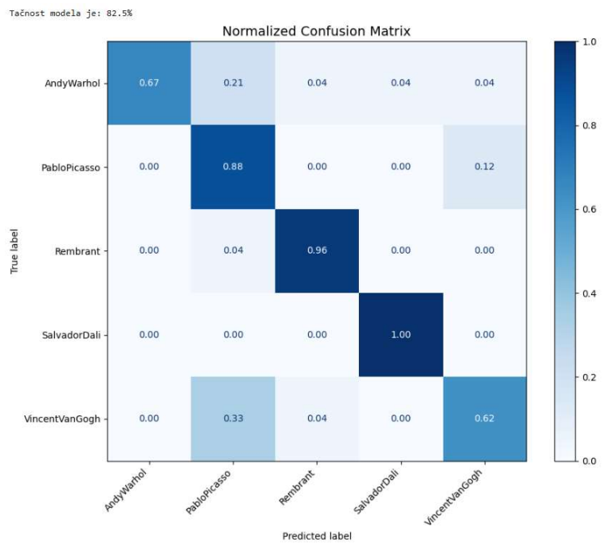
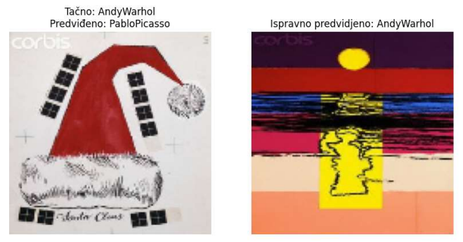
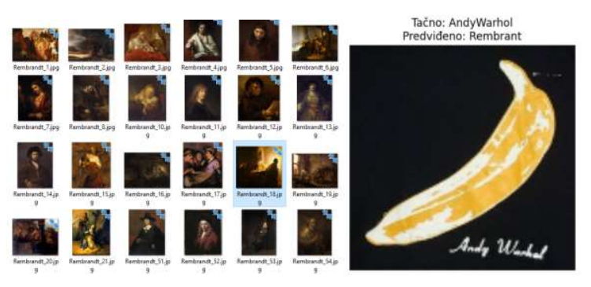

# Artist Classification Using Convolutional Neural Network

A deep learning project that classifies artworks by famous artists using Convolutional Neural Networks. The model is trained to distinguish between paintings from five renowned artists: Andy Warhol, Pablo Picasso, Rembrandt, Salvador Dali, and Vincent van Gogh.

## Project Overview

This project implements a multi-class image classification system using TensorFlow/Keras to identify the artist of a given painting. The Convolutional Neural Network architecture includes data augmentation techniques to improve model generalization and achieve robust classification performance.

## Dataset

The dataset is not included in the repository due to its size.

### Dataset Source

Images were obtained from the [Best Artworks of All Time](https://www.kaggle.com/datasets/ikarus777/best-artworks-of-all-time) dataset on Kaggle. The original dataset has been manually reduced to 120-150 samples per artist for training and 25-30 samples per artist for testing to create a more manageable dataset size.

### Dataset Setup

1. Download the dataset from: [Dataset Link](https://drive.google.com/file/d/1tLvrwddM-rss-AhW405Nfe4VNG-gwpzn/view?usp=drive_link)
2. Extract and organize the files so that the structure looks like this:

```
artists/
    Andy Warhol/
    PabloPicasso/
    Rembrant/
    SalvadorDali/
    VincentVanGogh/
test/
    Andy Warhol/
    PabloPicasso/
    Rembrant/
    SalvadorDali/
    VincentVanGogh/
```

Each directory contains images of artworks by the respective artist.

### Dataset Distribution

<p align="center">
  
</p>

The bar chart above shows the number of samples per artist class in the training dataset.

### Sample Artworks by Artist

<p align="center">
  
</p>

Representative artwork samples from each artist in the dataset.

## Model Architecture

The Convolutional Neural Network model consists of the following layers:

1. **Data Augmentation Layer**
   - Random horizontal flip
   - Random rotation (25% range)
   - Random zoom (10% range)

2. **Convolutional Layers**
   - Conv2D (16 filters, 3x3 kernel) + MaxPooling2D
   - Conv2D (32 filters, 3x3 kernel) + MaxPooling2D
   - Conv2D (64 filters, 3x3 kernel) + Dropout (0.2)

3. **Dense Layers**
   - Flatten layer
   - Dense (128 units, ReLU activation)
   - Dense (5 units, Softmax activation)

<p align="center">
  
</p>

Visual representation of the Convolutional Neural Network architecture.

### Model Parameters

- Input image size: 128x128 pixels
- Batch size: 128
- Optimizer: Adam (learning rate: 0.001)
- Loss function: Sparse Categorical Crossentropy
- Early stopping: Patience of 10 epochs

## Features

- **Data Visualization**: Distribution of samples per class and sample images from each artist
- **Data Augmentation**: Real-time image augmentation to prevent overfitting
- **Training Monitoring**: Training and validation accuracy/loss tracking
- **Performance Evaluation**: Confusion matrix and detailed metrics (accuracy, precision, recall, F1-score)
- **Early Stopping**: Prevents overfitting by monitoring validation loss

### Training Data Samples

<p align="center">
  
</p>

Random samples from the training dataset showing the variety of artworks.

### Data Augmentation Examples

<p align="center">
  
</p>

Visualization of augmented images showing the effects of random flip, rotation, and zoom transformations.

## Requirements

```
numpy
matplotlib
tensorflow
keras
scikit-learn
Pillow
```

## Results

The model is evaluated using:

- **Accuracy**: Overall classification accuracy
- **Confusion Matrix**: Visualization of prediction patterns
- **Per-Class Metrics**: Precision, recall, and F1-score for each artist

### Training History

<p align="center">
  
</p>

The plot shows training and validation accuracy, loss, and error rates across epochs.

Training history plots show:
- Training vs validation accuracy
- Training vs validation loss
- Training vs validation error rates

### Confusion Matrix - Training Set

<p align="center">
  
</p>

Normalized confusion matrix showing the model's predictions on the training set.

### Confusion Matrix - Test Set

<p align="center">
  
</p>

Normalized confusion matrix showing the model's predictions on the test set.

### Per-Class Performance Metrics

| Artist | Accuracy | Precision | Recall | F1-Score |
|--------|----------|-----------|--------|----------|
| Andy Warhol | 0.917 | 0.792 | 0.792 | 0.792 |
| Pablo Picasso | 0.850 | 0.625 | 0.625 | 0.625 |
| Rembrandt | 0.975 | 0.920 | 0.958 | 0.939 |
| Salvador Dali | 0.942 | 0.815 | 0.917 | 0.863 |
| Vincent van Gogh | 0.883 | 0.750 | 0.625 | 0.682 |

Detailed metrics (accuracy, precision, recall, F1-score) for each artist class on the test set.

### Classification Examples

#### Correct & Incorrect Classification

<p align="center">
  
</p>

Example of one correctly classified artwork where the model successfully identified the artist, and one misclassified artwork showing the limitations of the model.

## Model Evaluation

The notebook includes comprehensive evaluation on both training and test sets:

- Normalized confusion matrices showing classification patterns
- Per-class performance metrics
- Visual comparison of predicted vs actual labels

## Technical Details

### Preprocessing
- Images are resized to 128x128 pixels
- Pixel values are normalized to the range [0, 1]
- Data augmentation is applied during training

### Training Process
- The model uses early stopping with a patience of 10 epochs
- Best weights are restored after training
- Training history is tracked for analysis

### Evaluation Metrics
For each artist class, the following metrics are calculated:
- **Accuracy**: Proportion of correct predictions
- **Precision**: Proportion of true positives among predicted positives
- **Recall (Sensitivity)**: Proportion of true positives among actual positives
- **F1-Score**: Harmonic mean of precision and recall

## Model Limitations

### Color and Style Bias

The model primarily learns from visual features such as colors, shading, and painting techniques. This can lead to misclassifications when artworks share similar visual characteristics but are from different artists.

#### Example: Andy Warhol Banana Misclassified as Rembrandt

<p align="center">
  
</p>

This Andy Warhol banana artwork was incorrectly classified as Rembrandt due to the similar color palette and shading techniques. Despite the visible "Andy Warhol" signature on the image, the current model only considers visual features and cannot read text from images.

This limitation highlights an important area for improvement: incorporating text recognition capabilities to identify artist signatures and dates present in many artworks.

## Future Improvements

Potential enhancements to the project:
- Automate dataset sampling and reduction process programmatically instead of manual selection
- Implement Optical Character Recognition (OCR) to extract text from images (signatures, dates) as additional features for classification
- Experiment with deeper architectures (ResNet, VGG, etc.)
- Implement transfer learning with pre-trained models
- Expand the dataset with more artists and artworks
- Fine-tune hyperparameters for better performance
- Add model deployment capabilities
- Implement ensemble methods for improved accuracy
- Combine visual features with text-based features for more robust predictions
